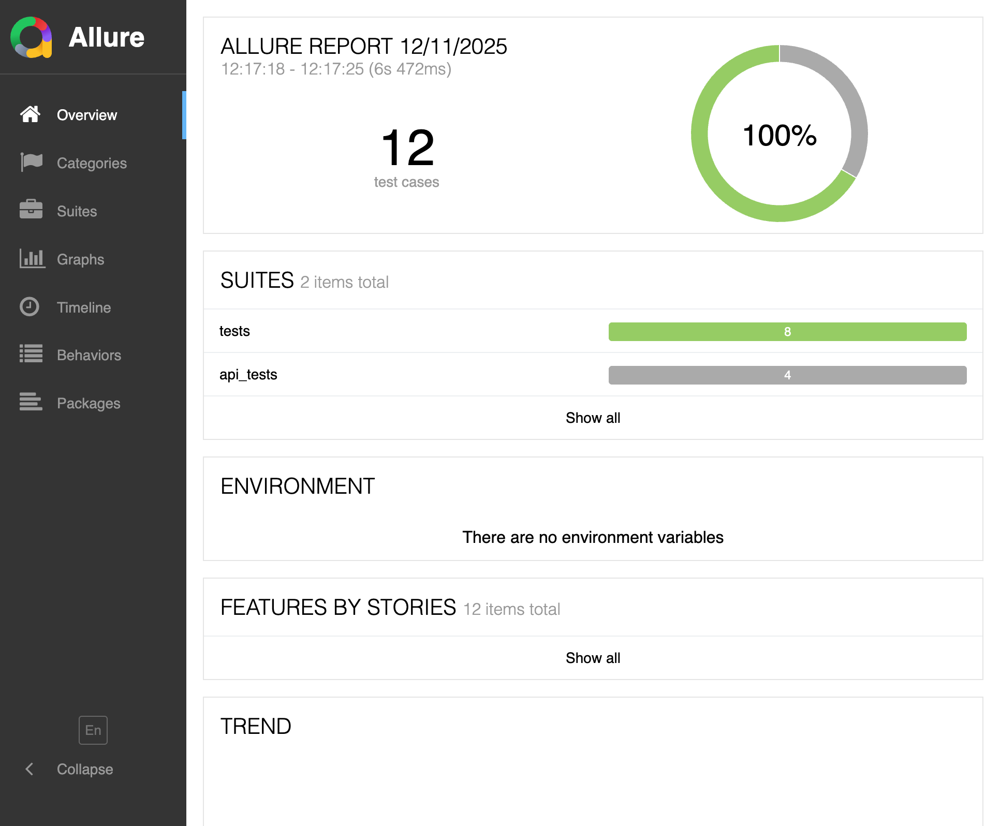
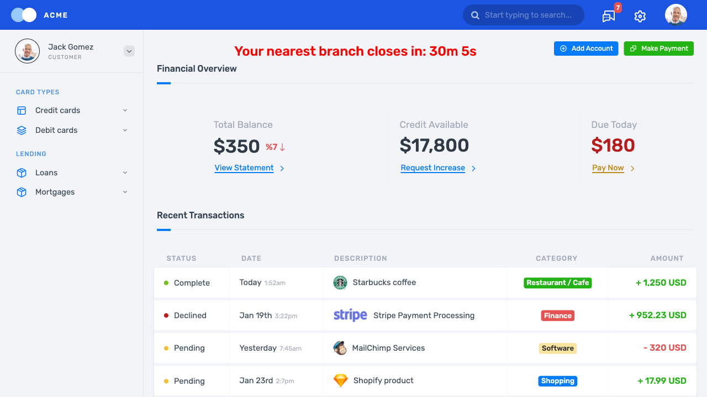

# Playwright UI Testing Project


This repository contains automated **UI and API tests** for the demo banking application  
https://demo.applitools.com  
using **Python**, **Pytest**, **Playwright**, **Allure**, and **GitHub Actions CI**.

The goal of the project is to demonstrate a clean automation architecture similar to enterprise-level frameworks, including:
- Page Object Model (POM)
- Cross-browser execution (Chromium, Firefox, WebKit)
- HTML reports published via GitHub Pages
- Allure reporting
- API testing module
- CI pipeline with artifacts (screenshots, video, trace, allure-results)

---

## Features

### Cross-browser UI automation
Tests run in 3 browsers via CI matrix:
- **Chromium**
- **Firefox**
- **WebKit**

### Page Object Model (POM)
Clear separation of UI interactions into reusable page classes.

### API Tests
Lightweight API suite using `requests` and public API `reqres.in`.

### Automatic screenshots, video & trace
All failures generate:
- Screenshots  
- Playwright videos  
- Playwright trace files  

### HTML report (pytest-html)
Latest report auto-published via GitHub Pages:

**https://rmpetrov.github.io/playwright-tests/**

### Allure reporting
Local Allure report generation with full metadata:

```bash
pytest -v --alluredir=allure-results
allure serve allure-results
```

CI also uploads **allure-results** as artifacts for every browser.

---

## Project Structure

```text
my-playwright-tests/
  pages/
    login_page.py
    dashboard_page.py

  tests/
    test_login.py
    test_dashboard.py

  api_tests/
    test_users_api.py

  screenshots/             
  test-results/            
  allure-results/          

  conftest.py
  pytest.ini
  requirements.txt
```
---

## Test Reporting Stack

### Pytest + pytest-html  
Generates static HTML reports.  
In CI, Chromium report is auto-deployed to GitHub Pages.

### Allure Framework  
Enterprise-grade reporting: steps, attachments, categories, timelines.

Local usage:

```bash
pytest --alluredir=allure-results
allure serve allure-results
```

### GitHub Actions CI  
Pipeline includes:

- Python & Playwright installation  
- Matrix execution in 3 browsers  
- Storage of:
  - HTML reports  
  - Videos  
  - Traces  
  - Screenshots  
  - Allure results  
- Auto-deploy of HTML report

---

## How to Run Tests Locally

### 1. Create virtual environment

```bash
python -m venv .venv
source .venv/bin/activate
```

### 2. Install dependencies

```bash
pip install -r requirements.txt
playwright install
```

### 3. Run entire suite

```bash
pytest -v
```

### 4. Run only UI tests

```bash
pytest tests/ -v
```

### 5. Run only API tests

```bash
pytest api_tests/ -v
```

### 6. Generate Allure report

```bash
pytest --alluredir=allure-results
allure serve allure-results
```

---
## Screenshots

### HTML Test Report (GitHub Pages)


### Allure Report Dashboard


### Playwright Trace Viewer



---

## 📈 Future Enhancements

- More negative UI scenarios  
- API client layer abstraction  
- Allure step decorators & severity tags  
- Dockerized test environment  


---

**Author:** Roman Petrov  
**GitHub:** https://github.com/rmpetrov