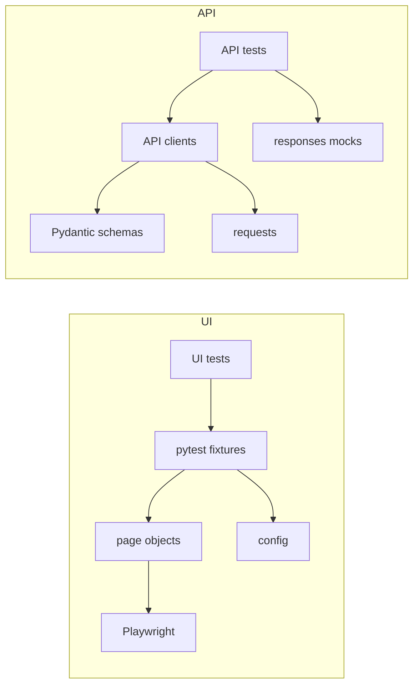

# Architecture

## Overview
This project is structured around a clear separation of tests, page objects, fixtures, and configuration. UI and API automation live in the same repository but use separate suites and dependencies.

## High-Level Flow


## Folder Map
```text
my-playwright-tests/
  pages/            # UI page objects
  tests/            # UI test suite
  api_tests/        # API test suite
  config.py         # Environment-based settings
  docs/             # Documentation
  scripts/          # CI helper scripts
```

## Key Components
- `pages/`: Page Object Model classes that encapsulate UI behavior
- `tests/`: UI tests and Playwright fixtures
- `api_tests/clients/`: Typed API client methods
- `api_tests/schemas/`: Pydantic models for request and response validation
- `config.py`: Single source of truth for environment settings

## Execution Model
- UI tests use a shared auth storage state and consistent timeouts
- API tests are deterministic and do not require external services
- CI runs API tests first, then UI tests in a 3-browser matrix

## Design Rationale
- POM keeps UI interactions reusable and readable
- Central fixtures reduce duplicated setup and improve stability
- Typed schemas make API contract checks explicit and maintainable
